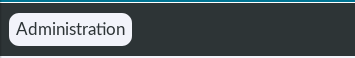
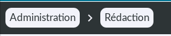

### >> Administration :
[TOC]

<br/>

---

# Introduction
**bulb** provides an administration especially created to interact with Neo4j databases and to give us some other functionalities.

<br/>

# Setting up the administration

Bulb's administration isn't automatically set when you implement bulb into your project.
But you can set it up with only 2 small steps :

1) Firstly, you'll have to define the administration's url via the **BULB_ADMIN_BASEPATH_NAME** settings' variable.
For example, if you define this variable on **"my_admin"**, the administration will be accessible at _**www.mydomain.com/my_admin/**_    
Per default, **BULB_ADMIN_BASEPATH_NAME** is defined on **"admin"**.

2) Finally, go in the global **urls.py** file of your project, comment the line of the native Django's administration (if it isn't already done) and implement the **bulb**'s one like this :

>> <small>urls.py</small>
```python
# from django.contrib import admin
from django.urls import path, include
from django.conf import settings

urlpatterns = [
    # path('admin/', admin.site.urls),
    path(f"{settings.BULB_ADMIN_BASEPATH_NAME}/", include("bulb.contrib.admin.urls")),
]
```

<br/>

Now you can access to the administration via the url that you've defined with **BULB_ADMIN_BASEPATH_NAME** settings' variable

> _Note that the administration may not have style, if you haven't followed the "Staticfiles" part of this documentation_

<br/>
<br/>

# Modularity
<br/>

Natively, **bulb**'s administration contains only the "Handling" part (see the Handling part of this documentation to learn more about it).
Later, it'll also contain a "Statistic" part, a "Logs" part, and a "Bulb news" part.

But the administration is highly modular, you can add your own administrations' modules : for example a module especially designed to create and edit the articles of an on-line newspaper, for the editorial team.

<br/>

Let's see how you can do this :

1) Firstly, be sure that the administration is correctly deployed, following the steps of the previous part.

2) Secondly, create a Django application for your new administration's module with the command **`python manage.py startapp <your app name>`**.

3) Thirdly, create a template in your new application, which will be the home of your new administration's module. This template must inherit of the administration's base template located in **`bulb/contrib/admin/templates/admin/background_pages/base.html`**. So you have to add this line at the head of your new template :

```django

```

But you can find a generic template especially designed to create a template for a new administration's module at **`bulb/contrib/admin/templates/admin/background_pages/generic_template.html`**. It'll allow you to quickly inherit of the base template :

>> <small>generic_template.html</small>
```django











```

<br/>

Then, fill each block of your new module's page :     

- The **title** block defines the content of the **`<title></title>`** page's tag.

<br/>

- The **head** block defines the content of the **`<head></head>`** page's tag.     
Note that the header contains already these 3 lines per default :

```django
<title></title>
<meta charset="utf-8">
<meta name="viewport" content="width=device-width"/>
```

<br/>

- The **administration_part_name** block defines the part of the administration's breadcrumbs trail related to the current page.
Example inspired from [https://grassemat.info](https://grassemat.info) :

```django

    <i class="material-icons">keyboard_arrow_right</i>
    <a class="nav-link" href="">Rédaction</a>

```

(TODO LATER)> _Note that to inherit of the bulb's administration's style, the link's class must be **"nav-link"**._

Render when you're on the administration's home:



Render when you're on the home of your the new administration's module:



<br/>

- The **content**  defines the content of the **`<body></body>`** page's tag.  

<br/>   

- And finally, in the **scripts** block you'll have to put your **`<script></script>`** tags.    
Note that a loader script and a polyfill script are contained by default in the base template :

```django
<script>
    const loader_box = document.querySelector("div#loader_box");

    // Support no javascript browsers.
    loader_box.style.display = "flex";

    window.addEventListener("load", function () {
        loader_box.style.animation = "fade 500ms forwards";
        window.scroll(0, 0)

    })
</script>

<script crossorigin="anonymous"src="https://polyfill.io/v3/polyfill.min.js?flags=gated&features=blissfuljs%2Cdefault%2Ces2015%2Ces2016%2Ces2017%2Ces5%2Ces6%2Ces7"></script>

```

<br/>

Have a look to this full example inspired from [https://grassemat.info](https://grassemat.info) :

>> <small>editorial_home.html</small>
```django


Rédaction


    
        
            <link rel="stylesheet" type="text/x-scss" href=""/>
        

        <link href="https://fonts.googleapis.com/icon?family=Material+Icons" rel="stylesheet">


    
        <link rel="stylesheet" href=""/>
        <link href="https://fonts.googleapis.com/icon?family=Material+Icons" rel="stylesheet">




    <i class="material-icons">keyboard_arrow_right</i>
    <a class="nav-link" href="">Rédaction</a>



    

    <br/>
    <br/>
    <br/>

    <a id="create-instance-button" href=""><i class="material-icons">add</i></a>

    <table>
        <thead>
        <tr>
            
                <th>{{ field_name }}</th>
            
        </tr>
        </thead>

        <tbody>
        
            <tr>
                
                    <td 
                        class="true_td"
                    
                        class="false_td"
                    >
                        <a href="">
                            {{ property_tuple.1|truncatechars:40 }}
                        </a>
                    </td>
                
            </tr>
        
        </tbody>
    </table>




    <script src="bundle.js"></script>

```

<br/>


4) Then, create a view in the **views.py** file of your new administration's module. The view must render the previous template.

Example inspired from [https://grassemat.info](https://grassemat.info) :

>> <small>views.py</small>
```python
@staff_only()
@login_required(login_page_url=login_page_url)
def editorial_home_view(request):
    if request.user.has_perm("view_article") or request.user.has_perm("view"):

        (...)

        return render(request, "editorial/pages/editorial_home.html", locals())    
```

<br/>

5) After, you'll have to fill the **urls.py** of your new administration's module, to create an url that will render the home page of this module.

>> <small>urls.py</small>
```python
from editorial.views import editorial_home_view
from django.urls import path, re_path

urlpatterns = [
    path("", editorial_home_view, name="editorial_home")
]

```

<br/>


6) Finally, you have to fill the settings' variable **BULB_ADDITIONAL_ADMIN_MODULES** with this syntax :

>> <small>settings.py</small>
```python
BULB_ADDITIONAL_ADMIN_MODULES = {
                                    "<application 1 name>": {
                                        "printed_name": "xxx",
                                        "path_name": "xxx",
                                        "home_view_url_name": "xxx"},

                                    "<application 2 name>": {
                                        "printed_name": "xxx",
                                        "path_name": "xxx",
                                        "home_view_url_name": "xxx"},

                                    "<application 3 name>": {
                                        "printed_name": "xxx",
                                        "path_name": "xxx",
                                        "home_view_url_name": "xxx"},

                                    (etc...)
                                }

```

<br/>

Example inspired from [https://grassemat.info](https://grassemat.info)

>> <small>settings.py</small>
```python
BULB_ADDITIONAL_ADMIN_MODULES = {
                                    "editorial": {
                                        "printed_name": "Rédaction",
                                        "path_name": "redaction",
                                        "home_view_url_name": "editorial_home",
                                    },
                                }
```

<br/>

7) Now, for each new page of your administration's module, you'll have to follow the previous steps (except the **6**th step).

<br/>
<br/>
<br/>
