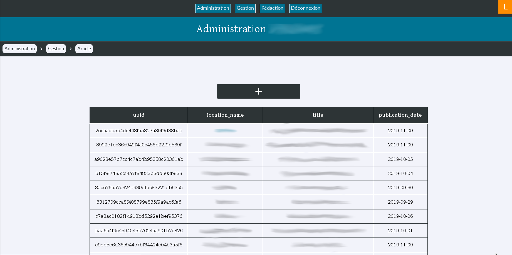
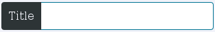
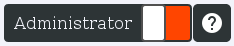
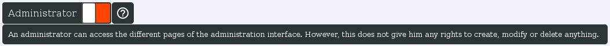
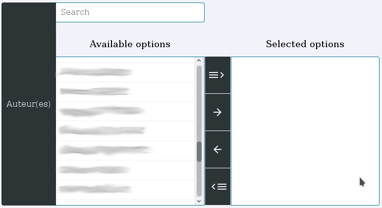

### >> Handling :
[TOC]

<br/>

---

# Introducing
**bulb** provides an administration's module especially created to interact with Neo4j databases and do the CRUD (create, read, update, delete) queries without touching a single line of code. This module is called **"handling"** and is automatically activated when you set up the bulb administration (See the "Administration" part).

<br/>

The **handling** module is highly customizable, and the only thing that you'll have to do, is to write into the **node_models_admin.py** to define which **node_models** must be present in the **handling** module and how each field of these node_models must be filled and printed.

<br/>
<br/>

# Preview fields

In the **node_models_admin.py** file of each application, two variables must be filled for each node_models of the corresponding application.

The first one must be called `<your node_models name>_preview_fields` (examples: Article_preview_fields, User_preview_fields, etc...)

This variable defines the printing of each node_model in their preview tables.

It is very easy to fill : just a dictionary, composed by numbers as keys (which ones represents the positioning in the preview table), and by node_models' properties' name as values.

Demonstration :

```python
Article_preview_fields = {"1": "uuid",
                          "2": "location_name",
                          "3": "title",
                          "4": "publication_date"}
```

Render :



<br/>
<br/>

# Fields infos

The second variable of the **node_models_admin.py** files must be called `<your node_models name>_fields_infos` (examples: Article_fields_infos, User_fields_infos, etc...)

This one defines the creating/editing forms' renders and their behaviors.
You can access to these forms by clicking on an instance on the preview table of a node_model, or on the **+** button located above each preview table.

This variable must be also filled with a dictionary, which one takes as keys the names of all the properties of a node_model, and as value an other dictionary that contains **the configurations informations** :

<br/>

- (required) The **"label"** of the field, which one corresponds to the name of the field that will be printed before the field.

Render for `"label": "Title"`



<br/>

- (optional) The **"description"** of the field. A little help box/description can be added to help the users of the handling.
If you introduce and fill the "description", an icon will appear next to the concerned field.

Render for `"description": "An administrator can access the different pages of the administration interface. However, this does not give him any rights to create, modify or delete anything."`



Render on click :



<br/>

- (required) The **"type"** of the field.      
Can be : **checkbox**, **locked**, **text**, **file**, **date**, **time**, **datetime**, **password**, **select**, **relationship**, **html**.

<br/>

- (required if `"type": "relationship"`) The **"rel"** parameter must be filled with a dictionary that contains two keys : **"related_node_model_name"** and **"choices_render"**.
In the first one, just write the name of the related node_models (the node_models of the other side of the relationship).
Then, fill the second one with a list of properties' names of the related node_models.

Example for articles' authors :

```python
Article_fields_infos = {"author": {"label": "Auteur(es)",
                                   "type": "relationship",
                                   "rel": {
                                            "related_node_model_name": "User",
                                            "choices_render": ["first_name", "last_name"],
                                    }},

                        (...)
                      }
```

Example's render :



Then, you'll just have to double-click on an available element to select it (you can also use the central buttons) and save with the green button ; the relationship between the article and the user will be automatically created.

<br/>

- (required if `"type": "relationship"`) 


<br/>
<br/>
<br/>
