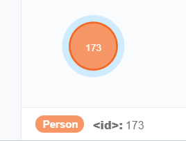
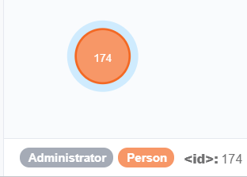
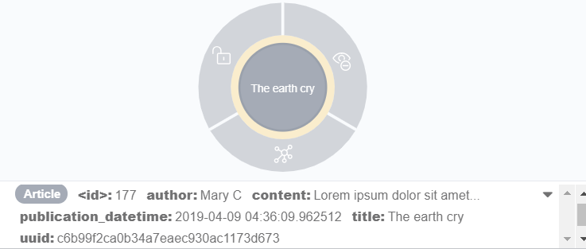

### >> Nodes :
[TOC]

<br/>
<br/>

---

# Introducing
**bulb** provides a group of classes used to structure and manipulate nodes and their properties.  
Only the most important things have been introduced, in order to leave lots of flexibility to the package's user and not to burden him with useless things.  
Furthermore, when you work with a database, personalization of each request is the key of fast and powerful interactions.  So don't hesitate to make your own request, for complexes works.
<br/>
<br/>
<br/>

---

# Node models  
> Note that all **node models** in each application, must be written in files named **`node_models.py`**.  

<br/>

- ## Implement and create node models

Whereas **Django** proposes **models** for relational databases, **bulb** introduces the **node-models** for graph databases. Principle is the same : make classes that represent database entities, and that give the possibility to interact easily with them.  
A node-models class is a class that inherits from the **`Node`** class, imported from **`bulb.db.node_models`**.  
Like with Django models, you will have to instantiate these node-models classes to automatically create a node in the database.  
<br/>
Demonstration :

>> <small>node_models.py</small>
```python
from bulb.db import node_models


class Person(node_models.Node):
    pass


Person()
```  
<br/>

Preview on Neo4j Desktop :


<br/>
<br/>

Create Node is not harder than that !  
Now, let's see how to handle the labels of ours nodes.

<br/>
<br/>

- ## Work with nodes
<br/>

> - ### Retrieve nodes

All the node models classes possess a **`get()`** method. This method takes many parameters to able us to do very complex and customizable requests :

- **`uuid`** (required): The Universal Unique Identifier of a node to get an unique instance.   
<br/>
- **`order_by`** (optional, default=None) : Must be the name of the property with which the returned datas will be sorted.   
Examples : "datetime", "first_name", etc...  
<br/>
- **`limit`** (optional, default=None) : Must be an integer. This parameter defines the number of returned elements.    
<br/>
- **`skip`** (optional, default=None) : Must be an integer. This parameter defines the number of skipped elements. For example if self.skip = 3, the 3 first returned elements will be skipped.     
<br/>
- **`desc`** (optional, default=False) : Must be a boolean. If it is False the elements will be returned in an increasing order, but it is True, they will be returned in a descending order.   
<br/>
- **`only`** (optional, default=None) : Must be a list of field_names. If this parameter is filled, the return will not be Node instances, but a dict with "only" the mentioned fields.     
<br/>
- **`filter`** (optional, default=None) : Must be Q statement. You must use the Q class stored in bulb.db Example: Q(name__contains="al") | Q(age__year__lte=8)     
<br/>
- **`distinct`** (optional, default=False) : Must be a boolean. If it is True, the returned list will be only composed with unique elements.    
<br/>
- **`return_query`** (optional, default=False) : Must be a boolean. If true, the method will return the cypher query.   
<br/>
Demonstration:      

>> <small>node_models.py</small>
```python
from bulb.db import node_models


class Person(node_models.Node):
    name = node_models.Property(required=True)

Person.create(name="John")
>>> <Person object(uuid="dcd220ab84b5417f8d8e48dd34237e9d")>


Person.create(name="Jane")
>>> <Person object(uuid="e724d344999342438431271ed39c7f92")>

Person.get()
>>> [<Person object(uuid="dcd220ab84b5417f8d8e48dd34237e9d")>, <Person object(uuid="e724d344999342438431271ed39c7f92")>]

```  

<br/>
<br/>

> - ### Delete nodes

Node models' instances possess a **`delete()`** method, which one delete allow us to delete nodes and all others linked to this nodes with a "CASCADE" relationship.

<br/>
<br/>


> - ### Make your own getter, setter and deletter

A node possesses native getter, setter and deletter, but these methods could be personalized for each Node class. Handle perfectly all the situations is impossible, and try to do this, leads to very heavy and inefficient programs. To make your own node methods, you'll just have to take the native methods and re-implement them with your modifications.  
The **bulb** authentication defines a node models named **`User()`**, and a **`get()`** method has been developed for this class. This method is based on the **uuid** and **email** properties of all instances of the **`User()`** class, because they are both required and unique properties.
Let's see it as an example and consider that this example is a bit more complex than what you will have to do generally.

Note that the returned value, if it contains nodes, should always be in a JSON style format, or be an instance.  
See : [Conventions](https://bulb.readthedocs.io/en/latest/conventions/).    


<br/>
<br/>
<br/>

---

# Labels
<br/>

- ## Create labels

By default, if no configuration is provided by the package's user, as you can see above, the only and unique label applied to the node is the name of the class he comes from.
On the other hand, labels of a node are also easily customizable.
To do that, you only have to define a **labels** attribute in your class (which one is inheriting from **`Node()`**), and put as the value of this attribute, a list that contains all the labels of the nodes that will be produced by the class.  
<br/>
Demonstration :

>> <small>node_models.py</small>
```python
from bulb.db import node_models


class Person(node_models.Node):
    labels = ["Person", "Administrator"]


Person()
```  
<br/>
Preview on Neo4j Desktop :


<br/>
<br/>

The labels propety can also be defined with a string only :

>> <small>node_models.py</small>
```python
from bulb.db import node_models


class Person(node_models.Node):
    labels = "Administrator"


Person()
```
<br/>
<br/>
> Note that **the class name is always added as a label**, so for the last example, the node created will have both "Person" and "Administrator" labels (even if we fill the **labels** attribute only with "Administrator").  
On the other hand, it is very recommanded to always add the **labels** attribute, even if the only desired label is the name of the class. This practice will lead to a more explicit and readable code.

<br/>
<br/>

- ## Work with labels

<br/>

> - ### Delete and update labels :

The deletion and the modification of labels is prohibited in a view to maintaining coherence.  
But if it's absolutely needed to do what you want to do, you could easily create method that delete and update labels.
<br/>
<br/>
<br/>

> - ### Retrieve labels :

You can easily retrieve labels of a node and then use them as you want.  
Two solutions exist :  
<br/>
You can simply access to the labels of a node named **`ABC`**, by doing  **`ABC.labels`**.  
But you can also use the **`get_labels()`** method of node objects like that: **`ABC.get_labels()`**
<br/>  
The two ways will return you a list of labels if there are many, and just a string if you have filled the labels attribute only with a string.  
<br/>
<br/>
<br/>

---

# Properties
<br/>

- ## Create properties

To end customization of our nodes, add them some properties.  
With the **bulb** package, a property is an instance of the **`Property()`** class imported from **`bulb.db.node_models`**.

The property can take 5 parameters :  

- **`key`** (required) : The key is often defined with the name of the property. The key will be used to access to an object property content (with the syntax **`(object).(key)`**) but also to do researches into the Neo4j database.  
<br/>
- **`content`** (do not fill) : The content is the value of a property, this parameter will be filled in during the instantiation of the future nodes. Do not fill the **content** parameter to set a default value, you must fill the **default** parameter to do that.  
<br/>
- **`required`** (optional) : If set on True, and if the content of the property is empty, an error will be raised.  
<br/>
- **`unique`** (optional) : If set on True, and if the content of the property combination key+content is already in the database, an error will be raised.  
<br/>
- **`default`** (optional) : A default value that will fill the content if it is empty.  
<br/>

Note that :

A property cannot have both **`required`** and **`default`** parameters (with a view to maintaining coherence).  
<br/>


Demonstration :

>> <small>node_models.py</small>
```python
from bulb.db import gdbh, node_models
from bulb.db.utils import make_uuid
import datetime


class Article(node_models.Node):
    labels = "Article"

    uuid = node_models.Property(key="uuid",
                                 default=make_uuid,
                                 unique=True)

    author = node_models.Property(key='author',
                                   default="An anonymous author.")

    title = node_models.Property(key='title',
                                  required=True,
                                  unique=True)

    content = node_models.Property(key='content',
                                    required=True)

    publication_datetime = node_models.Property(key="publication_datetime",
                                                default=datetime.datetime.now)


a_new_article = Article(author="Mary C",
                        title="The earth cry",
                        content="Lorem ipsum dolor sit amet...")


response = gdbh.r_transaction("MATCH (a:Article {author: 'Mary C'}) ")
print(response)


>>> [{'a': <Node id=177 labels={'Article'} properties={'title': 'The earth cry', 'uuid': 'c6b99f2ca0b34a
    7eaec930ac1173d673', 'publication_datetime': '2019-04-09 04:36:09.962512', 'author': 'Mary C', 'cont
    ent': 'Lorem ipsum dolor sit amet...'}>}]                 

```  

<br/>

Preview on Neo4j Desktop :

  

<br/>
<br/>

- ## Apply properties' restrictions
<br/>

For better performances, all properties restrictions of all your nodes should be applied in the Neo4j database. To apply all the restrictions contained in your project or update them if there are news, you can simply use the **`python manage.py bulb-apply`** command.  
<br/>
<br/>
<br/>
<br/>


- ## Work with properties

<br/>

>- ### Retrieve properties' values

As for the labels, you can easily access to the properties of a node with the syntax **`(object).(property key)`** :

>> <small>node_models.py</small>
```python
a_new_article.content

>>> 'Lorem ipsum dolor sit amet...'
```

You could also retrieve all the properties of a node with the **`get_properties()`** method of the Node's instances.

>> <small>node_models.py</small>
```python
a_new_article.get_properties()

>>> {'title': 'The earth cry', 'uuid': 'c6b99f2ca0b34a7eaec930ac1173d673',
 'publication_datetime': '2019-04-09 04:36:09.962512', 'author': 'Mary C',
  'content': 'Lorem ipsum dolor sit amet...'}
```

<br/>

>- ### Update properties' values

All node_models' instances possess an **`update()`** method, which takes as first argument the name of the property to update and as second argument, the new value of this property.

>> <small>node_models.py</small>
```python
from bulb.contrib.auth import User

john = User.get(email="john@mail.")

john.first_name
>>> 'John'

john.update("first_name", "Jo")

john.first_name
>>> 'Jo'

```

<br/>
<br/>
<br/>

---

# Methods

**bulb** provides methods (stored in **`bulb.db.utils`**) that perform the basic and frequently actions done.

- The **`make_uuid()`** method returns a Universal Unique Identifier. It is very useful to provide a unique property to identify efficiently node instances.


<br/>
<br/>
<br/>
